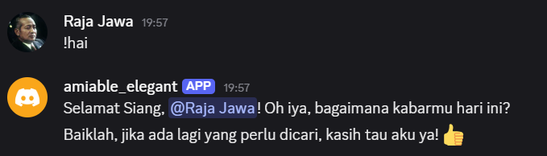
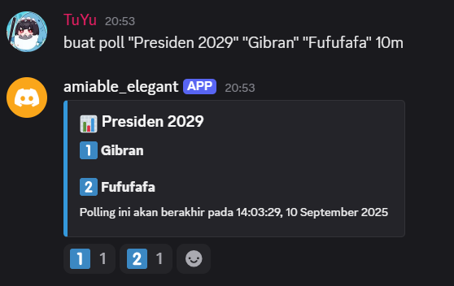
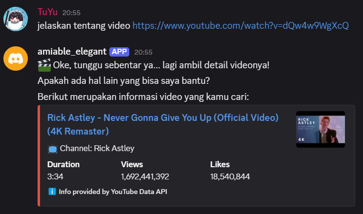
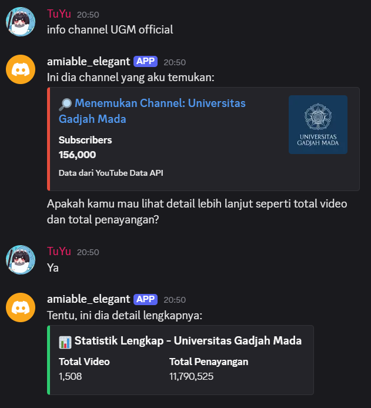
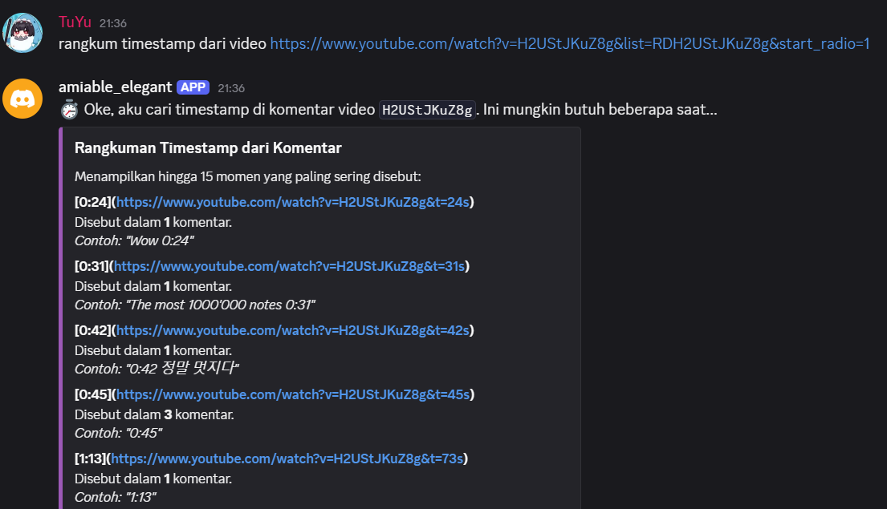
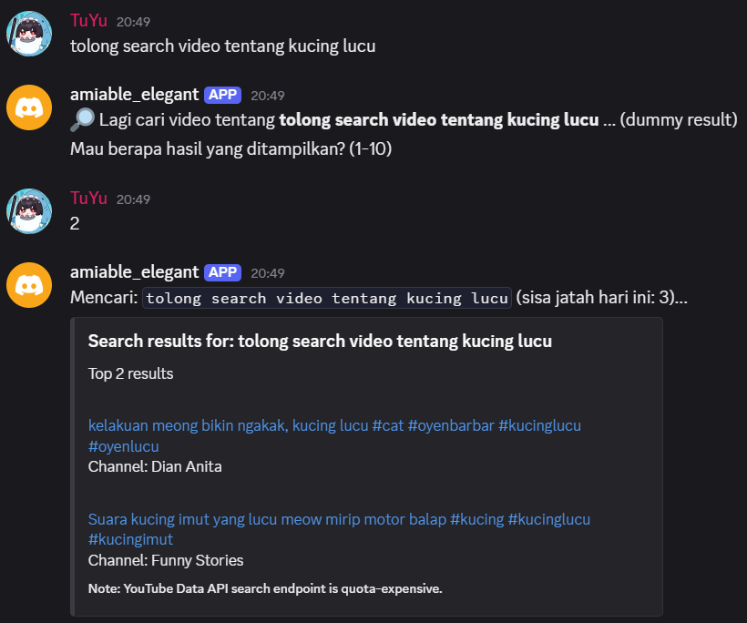

# Discord Chatbot (Regex-based)

---

## Ringkasan
Bot ini mendeteksi pola teks menggunakan regex untuk beberapa fitur utama seperti:
- Salam (hello)
- Info video YouTube (`ytinfo`) — mendukung input langsung atau meminta link
- Pencarian video YouTube (`ytsearch`) — bot menanyakan jumlah hasil (1–10)
- Statistik channel (`channelstats`) — bisa lewat nama, URL, atau handle
- Pencarian komentar di video (`findcomment`)
- Timestamp / penanda waktu (`timestamps`)
- Pembuatan polling (`poll`)

Bot juga menggunakan mekanisme *state* sederhana (`pending_ytinfo`, `pending_channelstats`) untuk menunggu jawaban pengguna.

---

## Prasyarat
- Python 3.8+ (direkomendasikan 3.10+)
- Akses ke Discord Developer Portal (buat aplikasi & bot)
- Token bot Discord
- API Key YouTube

---

## Dependensi (contoh `requirements.txt`)
```
discord.py
python-dotenv
pytest
pytest-asyncio
```

---

## Instalasi
1. Clone repo
```bash
git clone <repo-url>
cd <repo-folder>
```
2. Buat virtual environment (opsional tapi direkomendasikan)
```bash
python -m venv .venv
# Windows
.\.venv\Scripts\activate
# macOS / Linux
source .venv/bin/activate
```
3. Install dependensi
```bash
pip install -r requirements.txt
```
4. Salin file environment
```bash
cp .env.example .env
# atau di Windows PowerShell
copy .env.example .env
```

---

## Konfigurasi `.env` (.env.example)
Isi `.env` dengan variabel yang diperlukan.

```env
# Discord
DISCORD_TOKEN=your_discord_bot_token_here

# YouTube API key
YOUTUBE_API_KEY=your_youtube_api_key_here
```

---

## Mengaktifkan *Message Content Intent* di Discord
Karena bot menggunakan `on_message` dan membaca isi pesan, kamu harus mengaktifkan *Message Content Intent* di Discord Developer Portal:
1. Buka aplikasi bot di Discord Developer Portal
2. Di tab *Bot*, aktifkan `MESSAGE CONTENT INTENT`
3. Simpan perubahan

---

## Menjalankan bot
Jalankan entrypoint bot (`main.py`):

```bash
python main.py
```

---

## Daftar Perintah / Trigger (contoh input pengguna)

- **Salam**: `halo`, `hai`, `pagi`, `yo`, `sup`
- **Info video**: `tolong kasih info video ini`, `apa detail video youtube?`, atau langsung `https://youtu.be/<id>`
- **Cari video**: `cari video musik jazz`, `search video kucing lucu`, `play lagu anime`
- **Statistik channel**: `cek statistik channel UGM`, `berapa subscriber channel ini?`
- **Timestamps**: `timestamp 10:23`, `penanda waktu`, `menit ke 5:30`
- **Cari komentar**: `cari komentar lucu di video ini`
- **Poll**: `buat polling: mana yang kamu suka?`

---

## Demo — Tangkapan Layar

1. **Greeting (salaman)**



2. **Polling**



3. **YT Info**



4. **Channel Stats**



5. **YT Timestamp**



6. **YT Search**



---
